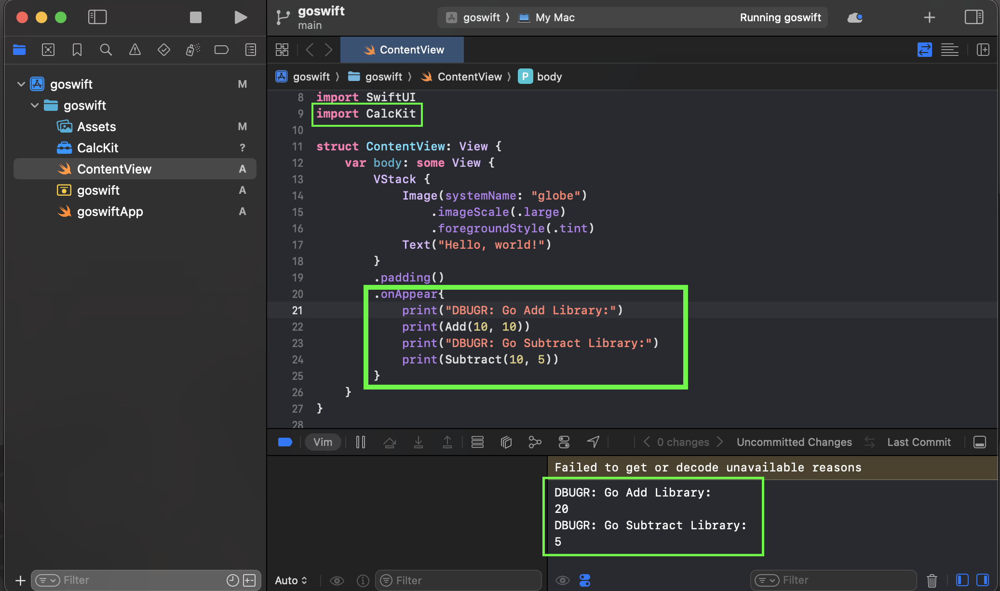

# README

This is a simple demonstration on how to use Go (as business logic) and SwiftUI
(as GUI logic) together. This involves leveraging Go's ability to export C API
and integrating it in xcode. This then allows the original Go logic to be shared
and used within a SwiftUI application.

This demo does not involve any
third-party libraries and you do not need to write any of the C code.

## How To Use

Assuming you have Go, x-code and xcodebuild do the following:

```sh
make buildc-arch
make create-xcframework-and-modulemap
```

Once you run the program you should see simple information in the debug window. The name `CalcKit` is just what I decided to the call the library that has the two Go functions `Add()` and `Subtract()`. This is named in `create-modulemap` rule in the Makefile.



## References

- https://mitchellh.com/writing/zig-and-swiftui
- https://developer.apple.com/documentation/xcode/creating-a-multi-platform-binary-framework-bundle
